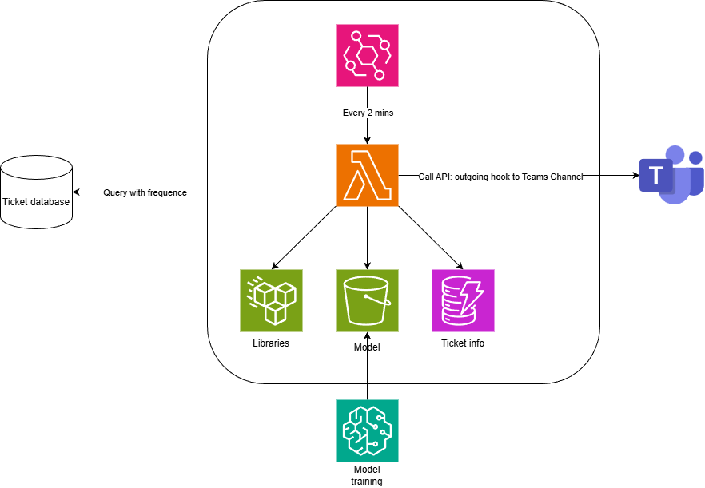

# End-to-End Serverless MLOps Pipeline Using AWS SageMaker, Lambda, and DynamoDB
This repo covers how I put together a serverless workflow on AWS to automate IT ticket routing. The setup uses SageMaker for the model and Lambda/DynamoDB/S3 for the rest of the pipeline.

# Architecture

  

